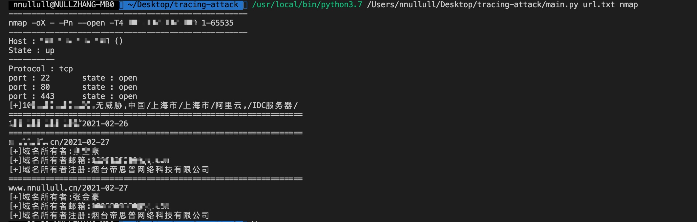

# ip溯源批量快捷工具小Demo
该工具综合微步api,dnsgrep,nmap,whois.4.cn进行相关ip查询
# 使用前提
该工具需要填入微步api token,填入 weibuapi_key.txt即可
若要使用反查域名，需要向dnsgrep申请一个token,填入代码中指定位置即可

# 使用方法
对url.txt中对域名进行遍历查询（不对端口进行查询）
- python3 main.py url.txt

对url.txt中对域名进行遍历输出（对端口进行查询）
- python3 main.py url.txt nmap

